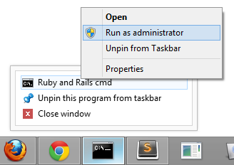

#How to Open Sublime Text via Command Line

##Overview
This guide assumes you are using **Windows** and the command prompt shortcut provided by the [Railsbridge installfest](http://installfest.railsbridge.org/installfest/). Because we are using this special command prompt shortcut, other **solutions you might find for how to open Sublime Text via command line might not work.** Those solutions don't account for our shortcut's special target. We're special --just as our respective mother's foretold.

**If you are not this guide's intended audience**, then I suggest checking out [this blog post](https://coderwall.com/p/9p4etg). Read the whole thing AND the few comments because the comments point out a key mistake.

This guide was originally created by [Jeff Lee](https://github.com/RebootJeff) (me) for [Erik Trautman's "Odin Project" curriculum](https://github.com/TheOdinProject/curriculum). When figuring out how to do all this stuff, I was using Windows 8. I have yet to try these steps on my WIndows 7 machine. I have no intention of trying these steps in Windows XP nor Vista.

##Step 0 - Complete Railsbridge Installfest
Before we get started, make sure you've completed the Railsbridge Installfest. This guide pertains to my fellow students who have sweated out the Installfest, and are now using the shortcut shown in [step 5](http://installfest.railsbridge.org/installfest/windows) of the instructions for Windows. The shortcut should have a target of
>"C:\Windows\System32\cmd.exe /E:ON /K C:\RailsInstaller\Ruby1.9.3\setup_environment.bat C:\RailsInstaller"

(or something similar --depending on your installation directory).

##Step 1 - Edit setup_environment.bat
Open the setup_environment.bat file in Sublime Text. You should be able to find the .bat file in your RailsInstaller directory. The target of your Ruby on Rails command prompt shortcut reveals the location of the .bat file. For me, the file path is:
>C:\RailsInstaller\Ruby1.9.3\setup_environment.bat

On line 26, you should see some code that looks like:
```bat
IF EXIST %ROOT_DIR%\Git\cmd SET PATH=%ROOT_DIR%\Git\cmd;%PATH%
```

Right below that line, you need to insert some code that discloses the location of sublime_text.exe on your computer. For me, I used the following code:
```bat
**SET PATH=C:\Program Files\Sublime Text 2;%PATH%**
```

I honestly don't know exactly what is going on here. I just Google'd around and read about some variable called "PATH" that must be modified. This code adds the Sublime Text directory to the list of directories already stored in PATH. The key is that all this is happening in setup_environment.bat (so instructions on modifying the PATH variable weren't working for me because those instructions did not account for this .bat file).

##Step 2 - Create symbolic link (optional)
At this point, it's already possible to open Sublime Text via command line, but you have to type out "sublime_text" as the command. My typing speed is stellar, but like a true engineer, I'm lazy. I want to type a shorter command, don't you? To do that, we must create a "symbolic link." What's that? I don't really know, but I saw it in the comment section of [this blog post](https://coderwall.com/p/9p4etg).

The symbolic link is created via command line with admin rights. Run the command prompt as administrator. If you pinned the command prompt shortcut to your taskbar as suggested by the Installfest, then right click on it, then right click on the first option provided by the context menu. Confused? Check the image below:



Once in the command prompt, navigate to your Sublime Text installation directory. Now type **mklink "[whatever you want the sublime command to be].exe" "sublime_text.exe"** and hit enter. The commands you use should look similar to the following:
```cmd
cd C:\Program Files\Sublime Text 2\
mklink "subl.exe" "sublime_text.exe"
```

Now if you look at your Sublime Text directory in Windows Explorer, you should see a new file similar to what's seen in the image below:


##Step 3 - Edit Sublime Text 2 settings
If you open a file with Sublime Text via command line, you will notice that Sublime Text opens a new window. This is annoying if you already have a Sublime Text window open. Wouldn't you rather have the file open in a new tab of the existing window? Yeaaaa.

Open Sublime Text any way you want. At the top of the window, click on Preferences. From here, you can click on "Settings - Default" or "Settings - User" depending on whether you want to adjust settings for all users on your PC or just for yourself. If you go with the former option, find the **"open_files_in_new_window"** setting and change it to _false_. If you go with the latter option, type in the setting and give it a value of false as shown below:


##Step 4 - Feel the Power
You can now type "subl [filename]" in the command line to begin editing files in Sublime Text. Without this power, your workflow consists of navigating files in Windows Explorer, editing files in Sublime Text, and interacting with Git/Github/Heroku in command prompt. Now that you have completed this guide, you can just stick with the command prompt and Sublime Text. Your new workflow now has a bit less alt-tabbing. Hallelujah.

Note: If you skipped step 2, then you must type "sublime_text [filename]" in the command line. How barbaric.
