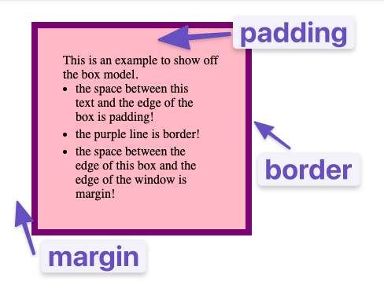

### Introduction
Now that you understand the basic syntax of HTML and CSS, we're going to get serious. The most important skills you need to master with CSS are _positioning_ and _layout_. Changing fonts and colors is a crucial skill to be sure, but even more important is being able to put things exactly where you want them on a webpage. After all, how may webpages can you find where absolutely every element is just stacked one on top of another?

### Learning Outcomes
* You'll learn about "Normal flow"
* You'll learn all about _the box model_.
* You'll learn how to make sure elements are just the right size with `margin`, `padding`, and `borders`
* You'll learn the difference between `block` and `inline` elements.

Learning to position elements on a webpage is not that difficult once you understand just a few key concepts. Unfortunately many learners race through learning HTML and CSS to get to JavaScript and end up missing these fundamental concepts. This leads to frustration, pain ([and funny gifs](https://giphy.com/gifs/css-13FrpeVH09Zrb2)), because all of the JavaScript skills in the world are meaningless if you can't stick your elements on the page where you need them to be. So, with that in mind let's get started.

### The Box Model
The most important concept that you need to understand to be successful in CSS is the box model. It isn't complicated, but skipping over it now will cause you much frustration down the line.

Basically, every single thing on a webpage is a rectangular box. These boxes can have other boxes in them and can sit alongside one another. When it comes down to it, laying out a webpage and positioning all of it's elements is basically just deciding how you are going to nest and stack these boxes.

The only real complication here is that there are multiple ways to manipulate the size of these boxes, and the space between them using `margin`, `padding`, and `border`s. The assigned articles go into more depth on this concept, but to sum it up briefly: padding increases the space between the edge of a box and the content inside of it, margin increases the space between this box and any others that sit next to it, and borders add space (even if it's only a pixel or two) between the margin and the padding. Be sure to study the diagrams carefully.

### Block vs Inline
The MDN article linked below mentions that different display types have subtly different box models, or that you can change how a box is calculated by changing the `display` property.

Most of the elements that you have learned about so far are block elements.  In other words, their default style is `display: block`. By default block elements will appear on the page stacked atop each other.

Inline elements, however, do not start on a new line. They appear in-line with whatever else they are placed beside. A clear example of an inline element is a link, or `<a>` tag. If you stick one of these in the middle of a paragraph of text, it will behave like a part of the paragraph.  The text of the link will sit alongside other words in that paragraph. Padding and margin behave differently on inline elements. In general, however,you do not want to try to put extra padding or margin on inline elements.

Inline-block elements behave like inline elements, but with block-style padding and margin.  Inline-block is a useful tool to know about, but in practice you'll probably end up reaching for flexbox more often if you're trying to line up a bunch of boxes.  Flex will be covered in depth in the next lesson.

### Assignment

1. [This video](https://www.youtube.com/watch?v=rIO5326FgPE) is a straightforward overview of the box model, padding and margin. Watch this first.
2. Because this concept is so incredibly fundamental, check out [this lesson from MDN](https://developer.mozilla.org/en-US/docs/Learn/CSS/Building_blocks/The_box_model). It covers the same material, but it goes a little further in depth. Pay close attention to the examples and take the time to experiment with their in-browser editor!
3. The concept of "Normal flow" is implied in the above resources, but isn't laid out very specifically. Read [this short article](https://developer.mozilla.org/en-US/docs/Learn/CSS/CSS_layout/Normal_Flow) to make sure you understand how elements lay themselves out by default.

### Practice

### Additional Resources
This section contains helpful links to other content. It isn't required, so consider it supplemental for if you need to dive deeper into something
* 

### Knowledge Check
*